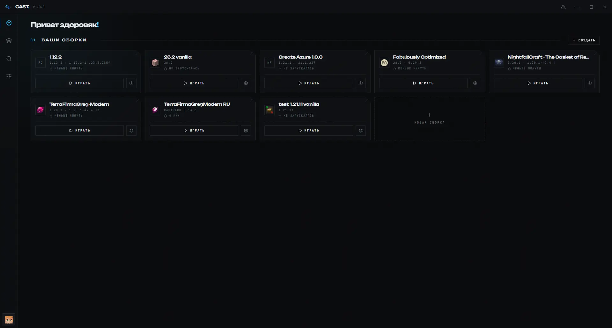
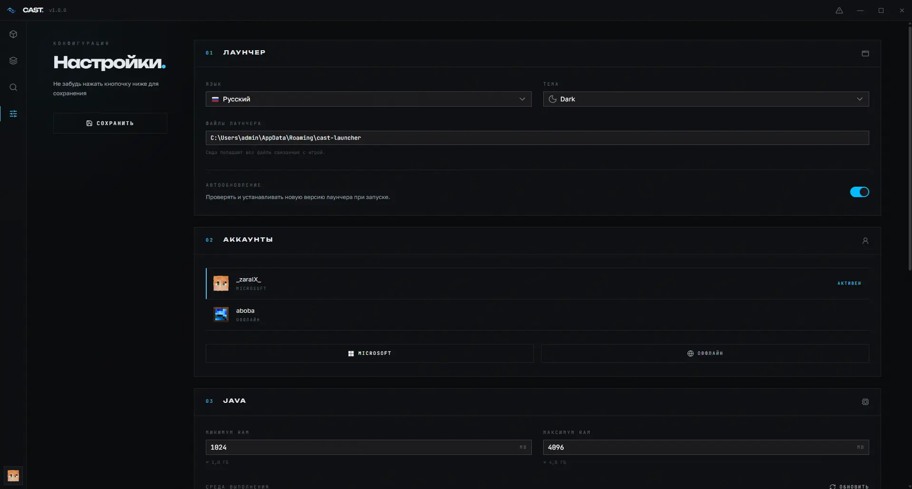

#  Cast Launcher
Cast Launcher is a new Minecraft Launcher, which in the future plans to provide a user-friendly interface, and new features in the form of server rentals, server listings, downloading minecraft maps, and unique modpacks! 

## Overview
This project is built using the following technology stack:

### Frontend:
- **Nuxt 4** (Vue-based framework)
- **Vite** (fast build tool)
- **TypeScript** (strictly typed JavaScript)
- **Tailwind CSS** (utility-first CSS framework)
- **Nuxt UI** (UI component library)

### Backend:
- **Rust** (high-performance, memory-safe backend)
- **Tauri 2** (desktop shell)

The backend is split into two crates: `cast-core` holds all the launcher logic (version metadata, downloads, installation, Java, launch arguments) and is covered by unit tests, while `src-tauri` is a thin layer that exposes it to the frontend as Tauri commands and events. The frontend never touches the filesystem or the network directly - everything goes through Rust.

## Features
- Install and run any Vanilla Minecraft version from [this manifest](https://piston-meta.mojang.com/mc/game/version_manifest_v2.json)
- Install and run Forge/NeoForge/Fabric, including the full Forge installer pipeline (binary patches, processors, legacy versions)
- Launch the latest Minecraft versions (older versions currently not supported, may be fixed in future updates)
- Support for offline and microsoft accounts
- Russian language support (localization for other languages planned)
- Parallel downloads with hash verification, resume and a live progress/installation status in the header
- Error center: readable errors with details and per-instance log viewer

### Instances
- Instance page with general info, Java settings, modpack info and logs
- Per-instance overrides for memory and Java (falls back to the global settings)
- Custom icons: pick from the built-in icon set or use the modpack icon
- Playtime tracking - total and last session

### Modpacks
- Search Modrinth modpacks with filters by loader, game version and category
- Install a modpack in one click, with mods, configs and overrides
- Update an installed modpack to another version - the launcher keeps track of pack files and removes the stale ones

### Java
- Scans the system for installed Java runtimes (registry, common install paths, `PATH`)
- Automatically picks a runtime matching the version requirements, or downloads the official Mojang runtime when none fits
- Manual mode for those who want to point at a specific `java` binary

### Importing
- Import instances from PrismLauncher and the Modrinth App
- Optionally reuse the shared assets, libraries and Java runtimes instead of downloading them again
- Icons and Modrinth pack links are carried over, so imported instances can still be updated

## Settings
- Launcher: language, theme, data directory, auto update
- Java: mode (auto/system/manual), path, min/max memory
- Accounts: add and switch between offline and Microsoft accounts
- Java runtimes: view detected runtimes and rescan the system
- Import: bring instances over from another launcher

## Gallery

