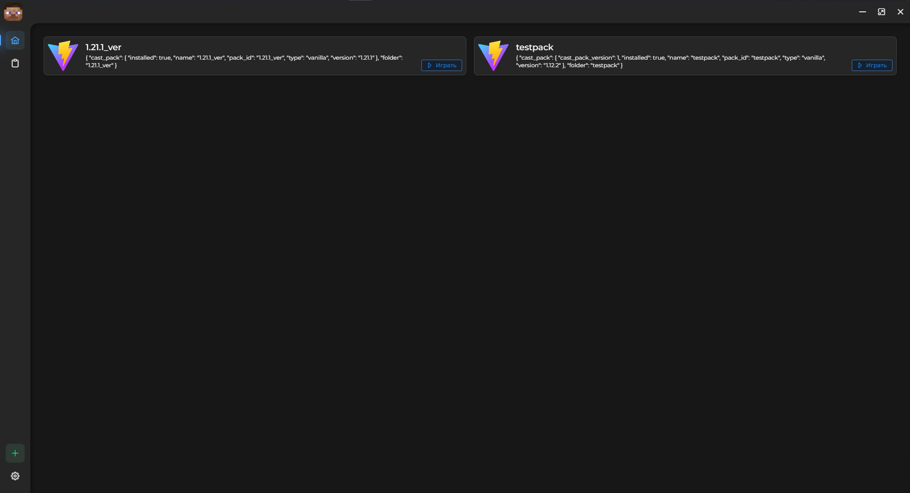

## On development..

**Tauri v2**

Stack front: Nuxt3 + Vite + Typescript + Tailwindcss + ElementPlus

Back: Rust

# Current functions
Installing and running versions (any from [here](https://piston-meta.mojang.com/mc/game/version_manifest_v2.json))
Running latest versions (old versions not launching, maybe i fix it later)
Offline accounts
Russian language (Later i want add localization)

## Galery
